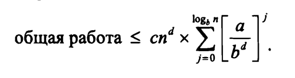
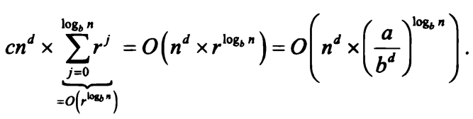

test
1. b
2. a
3. a
4. b
5. c
6. b
7. b
8. a

questions
1. x*y
   + Разделение входных чисел на половины a, b - x; c, d - y;
   + Перемножение ac, ad, bc, bd
   + Оъединение ac*10^n + (ad, bd)*10^(n/2) + bd
2. x*y
   + Разделение входных чисел на половины a, b - x; c, d - y;
   + Перемножение ac, bd, (a+b)(c+d)
   + Оъединение ac*10^n + ((a+b)(c+d) - ac - bd)*10^(n/2) + bd
3. Описание последовательности с помощью предыдущих членов последовательности
4. ?
5. параметры рекуррентного соотношения a=2, b=2, d=1; a=b^d (2=2^1); следовательно T(n) = O(n^d log(n)) = O(n log(n))
6. Да, рекурсивный алгоритм, можем описать рекуррентным соотношением с параметрами a=1, b=2, d=0
7. ?
8. ?количества разных подзадач на заданном уровне рекурсии j и длины входных данных для каждой из этих подзадач
9. ?
10. Имеем общую работу <= произведения количества подзадач на сумму работы на подзадачи на всех уровнях рекурсии
      
    + для 1 случая a=b^d, алгоритм выполняет одинаковое количесво работы на каждом уровне  
    подстановкой получаем произведение количества подзадач на сумму 1+logb(n) единиц, что равняется O(n^d log(n))  
    + для 2 случая a<b^d, число операций на новом уровне рекурсии меньше, чем на предыдущем  
    a/(b^d) < 1, имеем геометрическую прогрессию с r<1, 
    сумма которой будет <= r/(1-r), что является константой, получаем O(n^d)  
    + для 3 случая a>b^d, число операций на новом уровне рекурсии больше, чем на предыдущем  
    a/(b^d) > 1, имеем геометрическую прогрессию с r>1,
    сумма которой будет <= r^k * r/(1-r), O(r^k), где k=logb(n)   
    из чего имеем O(n^(logb(a)))

